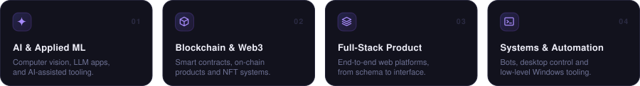
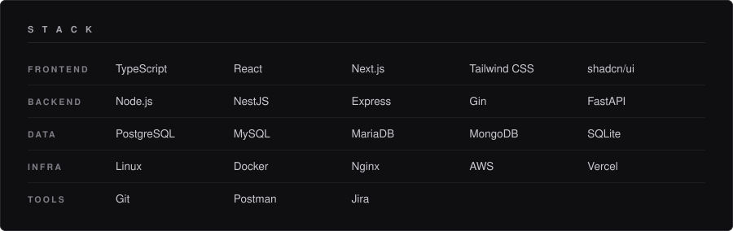
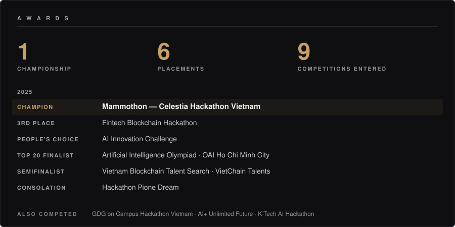

<!--
  Every graphic on this page is generated, not hand-drawn in an editor.
  Source of truth: scripts/build-assets.mjs  →  assets/*.svg
  Change a role, a stack entry or an award in that script's data blocks and run
  `node scripts/build-assets.mjs` (no dependencies). Do not hand-edit the SVGs.

  Block choice is load-bearing, not stylistic. GitHub gives 
 no margin and
  
 a 16px bottom margin, so a section header sits tight against the block it
  labels (
) while the last block of each section pushes the next section
  away (
). Keep it that way, and never leave a blank line inside one of these
  HTML blocks — that ends the raw-HTML run and the tags render as literal text.
-->

  

  
  

  
  
  
  
  
  

  

  <b>Engineer across the full stack, on-chain systems and applied AI.</b> 
  I build products end to end — from data model and smart contract to the interface people actually touch. 
  One championship and five further placements across nine hackathons and olympiads.

  

  

  

  

  

  

<!--
  A streak card (streak-stats.demolab.com) used to sit here and was removed on
  evidence, not taste. Its origin needs 13-22s to rebuild an uncached response;
  GitHub's camo proxy gives up after ~4.4s and serves 504, so the first visitor
  after any cache expiry gets a broken image. Measured against a freshly minted
  camo hash: 504 on all three loads. The graph below passed the same cold test
  at 200 in 0.66s. Re-run that check before adding any new external image here.
-->

  

  

