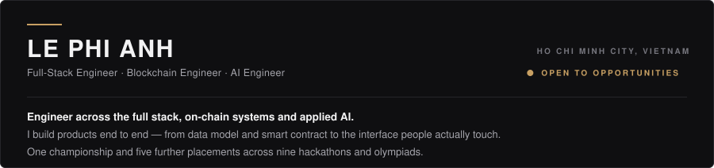

<!--
  Every graphic here is generated, not drawn in an editor.
  Source of truth: scripts/build-assets.mjs  →  assets/*.svg
  Change a role, a stack entry or an award in that script's data blocks and run
  `node scripts/build-assets.mjs` (no dependencies). Do not hand-edit the SVGs.

  Block choice is load-bearing, not stylistic. GitHub gives 
 no margin and
  
 a 16px bottom margin, so 
 keeps the two link rows together while 

  separates the sections. Never leave a blank line inside one of these HTML
  blocks — that ends the raw-HTML run and the tags render as literal text.
-->

  

  
  

  
  
  
  
  
  

  

  

<!--
  The only external image on the page. Verified against a freshly minted camo
  hash: 200 in 0.66s cold. A streak card was tried here and cut — its origin
  needs 13-22s to rebuild an uncached response while camo gives up at 4.4s, so
  it returned 504 on every cold load. Re-run that check before adding another.
-->

  

  

